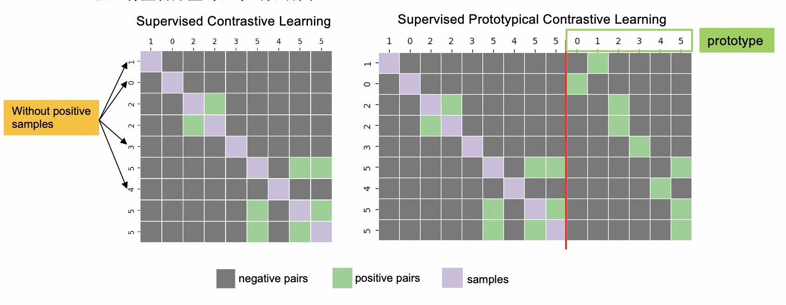

### Code for EMNLP2022 paper "Supervised Prototypical Contrastive Learning for Emotion Recognition in Conversation"


#### Overview

The main contribution of this work is the supervised prototypical contrastive learning(SPCL) loss, it is easy to understand via the following picture.



#### Requirements

```
pip install -r requirements
```

#### usage

```
python train.py
  -h, --help            show this help message and exit
  -te, --test           run test
  -tr, --train          run train
  -ft, --finetune       fine tune the best model
  -cl, --cl             use CL
  -pr, --print_error    print error case
  -mlp, --output_mlp    use an additional mlp layer on the model output
  -fgm, --fgm           use fgm
  -bsz BATCH_SIZE, --batch_size BATCH_SIZE
                        Batch_size per gpu
  -seed SEED, --seed SEED
                        seed
  -psz POOL_SIZE, --pool_size POOL_SIZE
                        Batch_size per gpu
  -ssz SUPPORT_SET_SIZE, --support_set_size SUPPORT_SET_SIZE
                        support size per gpu
  -epochs EPOCHS, --epochs EPOCHS
                        epochs
  -cluster_size AVG_CLUSTER_SIZE, --avg_cluster_size AVG_CLUSTER_SIZE
                        avg_cluster_size
  -lr LR, --lr LR       learning rate
  -ptmlr PTMLR, --ptmlr PTMLR
                        ptm learning rate
  -tsk TASK_NAME, --task_name TASK_NAME, it can be meld, iemocap and emorynlp
  -wp WARM_UP, --warm_up WARM_UP
  -dpt DROPOUT, --dropout DROPOUT
  -temp TEMPERATURE, --temperature TEMPERATURE
  -bert_path BERT_PATH, --bert_path BERT_PATH
  -train_obj TRAIN_OBJ, --train_obj TRAIN_OBJ it can be spcl, spdcl or ce
  -data_path DATA_PATH, --data_path DATA_PATH
  -temp_path TEMP_PATH, --temp_path TEMP_PATH
  -acc_step ACCUMULATION_STEPS, --accumulation_steps ACCUMULATION_STEPS
  
```

e.g., to train and eval the model on ```MELD``` dataset, 

```bash
python train.py -tr -wp 128 -epochs 16 -temp 0.05 -tsk (meld|iemocap|emorynlp) -psz 256 -ssz 64 -train_obj (spcl|spdcl|ce) -cl -seed 2333
```

#### key args

- ```epochs``` we use epochs to control the difficulty.
- ```psz``` size of representations queue
- ```ssz``` size of support set
- ```train_obj``` we describe the spcl in our paper, and an explanation of spdcl can be seen below
- ```temp``` the temperature used in contrastive loss


We use grid search to select the optim values for these args, but as we described in the ```Limitations```, we introduce too many randomness in our code, the optim values of these hyper-parameters changed with the seed.


#### what is ```spdcl```?

We describe the ```spcl``` loss in our paper,  meanwhile we develop the **decoupled** version of ```spcl```, called ```spdcl```, since the decoupled contrastive loss (https://arxiv.org/pdf/2110.06848.pdf) is not the contribution of this paper, we didn't describe this loss in our paper, and all results in the experiments are produced via ```spcl```. 

The ```spdcl``` shows similar performance with ```spcl``` , if you have limited computing resources, the ```spdcl``` may a better choice. See details in ```spcl_loss.py```.

If you have any questions, feel free to create issues or contact me at ```songxiaohui@iie.ac.cn``` or ```fpcsong@gmail.com```.
